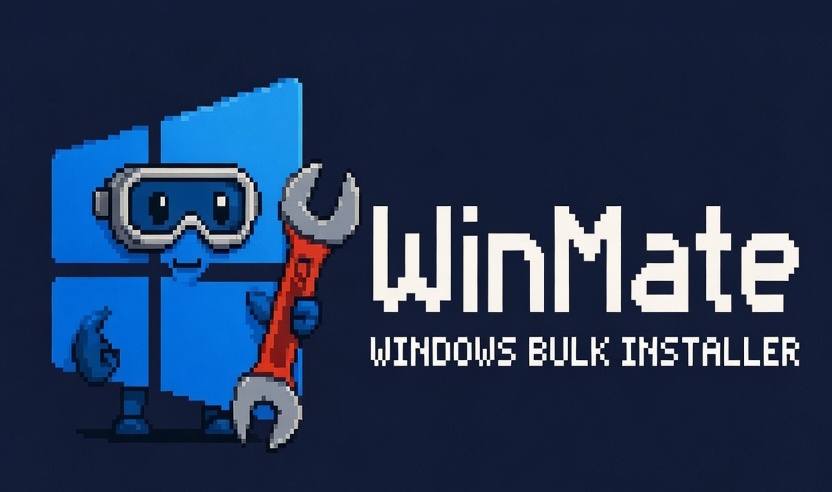

<div align="center">



**Reinstalled Windows? Get all your apps back in one go.**

WinMate is a free website that builds one install script for Windows.<br>
Pick apps, pick a package manager, run the script – done.

[](LICENSE)


**[→ winmate.pages.dev](https://winmate.pages.dev)**

</div>

---

## Features

- **344 curated apps in 24 categories**, including runtimes such as Visual C++ Redistributables, .NET, DirectX, XNA and Java.
- **Verified package IDs.** Every winget, Scoop and Chocolatey ID is checked against the real repositories (`tools/validate_packages.py`).
- **Real app icons.** Each app has a hand-picked icon source (official Flathub icon, dashboard-icons, vendor site, …), downloaded and normalized by `tools/fetch_icons.py`.
- **Only one administrator prompt.** The script relaunches itself elevated once and runs every installer from there. Installers that refuse admin rights (e.g. Spotify) automatically run as the normal user.
- **Three ways to run:** double-click `WinMate-Install.cmd`, run the `.ps1`, or paste the script into PowerShell.
- **Robust:** registers winget on fresh installs, installs Scoop/Chocolatey if needed, installs runtimes first, retries failed apps once and prints a summary. Log: `%TEMP%\WinMate-install.log`.
- **Bundles:** Essentials, Gaming PC, Developer, Creator, Office & Study, Privacy.
- **Share links** (`?apps=firefox,vlc&pm=winget`) and selections saved in the browser.
- **SEO & LLM friendly:** static pages for every app, category and bundle in English and German, JSON-LD, `sitemap.xml` with hreflang, `llms.txt`, `llms-full.txt` and a public `apps.json`.
- **Private:** no cookies, no tracking, no third-party requests. Fonts and icons are self-hosted.

## How the single admin prompt works

```
WinMate-Install.cmd (normal user)
 ├─ registers winget if needed
 ├─ starts ONE elevated PowerShell  ──►  installs all normal apps silently (they inherit admin rights)
 │                                        writes results to %TEMP%\winmate-*.json
 ├─ installs "noAdmin" apps as the normal user (e.g. Spotify)
 └─ prints the combined summary
```

If the script is already started as administrator, the "noAdmin" apps are launched as the signed-in user through a one-time scheduled task. Scoop never needs admin rights.

## Project structure

```
data/
  apps.json          app catalog (the file you edit)
  categories.json    category names and intros (EN/DE)
  presets.json       bundles (EN/DE)
src/
  ps/engine.ps1      PowerShell installer engine embedded into every script
  js/app.js          script builder (no dependencies)
  css/style.css      styles (dark/light)
  icons/             app icons (generated by tools/fetch_icons.py)
  img/, fonts/       logo, favicons, OG image, self-hosted Silkscreen font
build.py             static site generator -> dist/
i18n.py              UI texts and FAQ (EN/DE)
tools/
  validate_packages.py   checks all package IDs against winget/Scoop/Chocolatey
  fetch_icons.py         downloads and normalizes icons
  test_script.py         parses the generated scripts, optional safe test run
```

## Local development

Requires Python 3.11+ (standard library only for the build).

```bash
python build.py                       # builds dist/
python -m http.server 8000 -d dist    # open http://localhost:8000
```

## Deploy to Cloudflare Pages

1. Push the repository to GitHub.
2. Cloudflare dashboard → **Workers & Pages → Create → Pages → Connect to Git** → select the repo.
3. Build settings:
   - Framework preset: **None**
   - Build command: `python3 build.py`
   - Build output directory: `dist`
   - Environment variable (optional): `SITE_URL=https://your-domain.tld` (default `https://winmate.pages.dev`)
4. Deploy. `_headers` (security + caching), `_redirects`, `sitemap.xml`, `robots.txt` and `llms.txt` are generated automatically.

After the first deploy, add the site to Google Search Console and Bing Webmaster Tools and submit `https://<domain>/sitemap.xml`.

## Adding or fixing an app

1. Add an entry to `data/apps.json`:

   ```json
   {"id": "vlc", "name": "VLC media player", "category": "media", "homepage": "https://www.videolan.org/vlc/",
    "winget": "VideoLAN.VLC", "scoop": "extras/vlc", "choco": "vlc", "icon": "flathub:org.videolan.VLC",
    "description": {"en": "Plays almost every audio and video format.", "de": "Spielt fast jedes Audio- und Videoformat ab."}}
   ```

   - `winget`: a string or a list of IDs. Microsoft Store apps use `msstore:<ProductId>`.
   - `scoop`: always `bucket/name`.
   - `noAdmin: true` for installers that refuse to run elevated (the validator tells you).
   - `icon`: `dash:<name>`, `flathub:<app-id>`, `url:<image-url>`, `site:<homepage>` or `gen:<text>` (see `tools/fetch_icons.py`).
2. Run the tools:

   ```bash
   python tools/validate_packages.py --elevation
   python tools/fetch_icons.py <id>        # needs: pip install pillow
   python tools/test_script.py
   python build.py
   ```

3. Check the icon on the page, then open a pull request.

## Disclaimer

WinMate was built with the help of Claude AI by Anthropic. It is not affiliated with Microsoft or any listed software vendor. All product names, logos and trademarks belong to their respective owners. Packages are provided by the winget, Scoop and Chocolatey communities – always review a script before running it.

## License

MIT – see [LICENSE](LICENSE).
